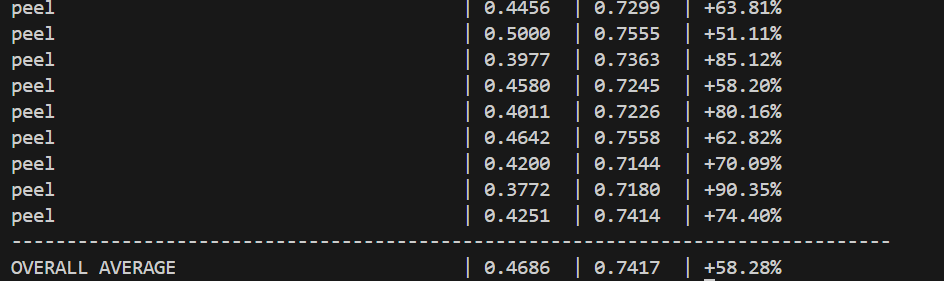
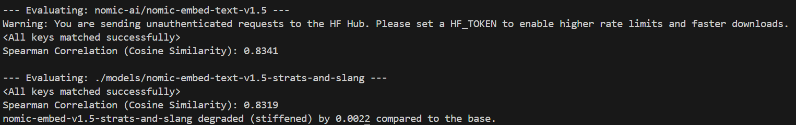
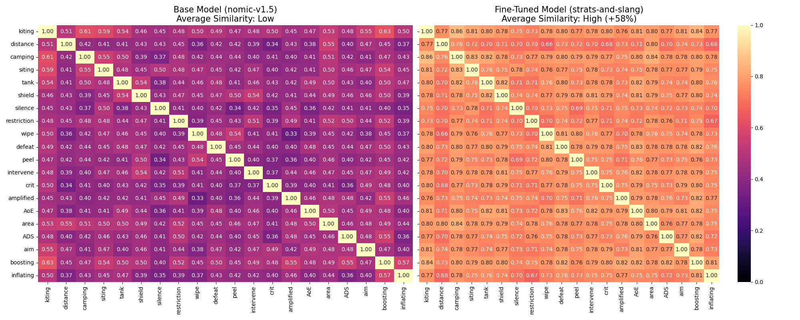
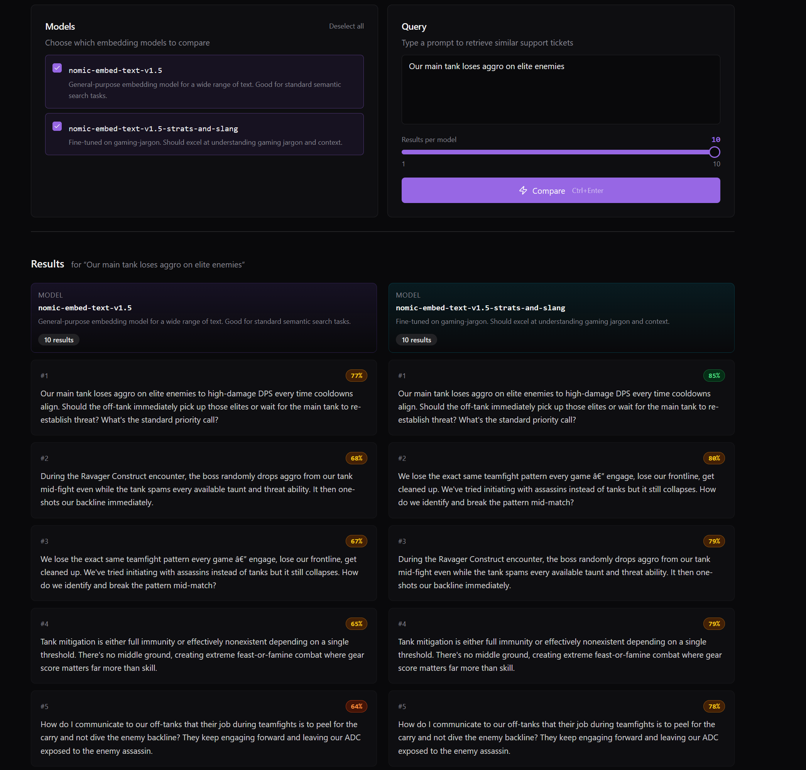

# Gamer Embed Tuner

### Fine-tuning `nomic-embed-text-v1.5` for gaming-specific semantic search

---

## The Problem

General-purpose embedding models fail on gaming language. When a player says *"my tank is pulling too much aggro"*, a vanilla model sees unrelated words. A gamer-tuned model understands they're saying *"the defensive player is drawing more enemy attention than they can handle"*.

This semantic gap causes RAG pipelines to surface irrelevant results and miss obvious matches across any gaming data source: support tickets, forum posts, wikis, patch notes, in-game chat logs, and more. **nomic-embed-text-v1.5-strats-and-slang** closes that gap by fine-tuning on jargon/layman pairs — the same idea written once in gaming slang and once in plain English.

---

## Project Structure

```
gamer-embed-tuner/
├── scripts/
│   ├── generate_data.py      # Generates training pairs via Ollama (qwen3:8b)
│   ├── blind_test.py          # Strict train/holdout split with quarantined terms
│   ├── fine_tune.py           # Fine-tunes nomic-embed-text-v1.5
│   ├── test_models.py         # Head-to-head cosine similarity comparison
│   ├── sts_b_test.py          # STS-B regression benchmark
│   ├── plot.py                # Heatmap visualization of embeddings
│   ├── seed.py                # Seeds ChromaDB with support ticket embeddings
│   └── main.py                # FastAPI backend for the playground
├── frontend/                  # React + Vite comparison playground
├── data/
│   ├── train_pairs_1130_gpt4.json   # 1130 GPT-4 generated jargon/layman pairs
│   ├── strict_train.json            # Training split (quarantined terms removed)
│   ├── strict_holdout.json          # Holdout split (quarantined terms only)
│   └── support_tickets.json         # Sample gaming data for playground RAG demo
├── models/                    # Fine-tuned model output (not included in repo, see Setup)
├── gamer_vector_db/           # ChromaDB persistent store
├── checkpoints/               # Training checkpoints
└── visuals/                   # Test result screenshots and plots
```

---

## Setup

### Prerequisites

- Python 3.10 to 3.12 (recommended). Python 3.13+ has questionable CUDA/PyTorch support and is not recommended.
- CUDA-capable GPU (trained on an RTX 3080)
- Node.js 18+ (for the playground frontend)

### Python Environment

```bash
python -m venv venv
source venv/bin/activate  # or venv\Scripts\activate on Windows
pip install -r requirements.txt
```

**Important:** The `torch` dependency in `requirements.txt` is pinned to a specific CUDA version (`cu124`). PyTorch builds are architecture-dependent. If your GPU uses a different CUDA version, install the correct PyTorch build for your system from [pytorch.org/get-started](https://pytorch.org/get-started/locally/) before installing the rest of the requirements.

Key dependencies: `sentence-transformers`, `torch` (CUDA), `chromadb`, `fastapi`, `datasets`, `seaborn`, `matplotlib`.

### Generate the Fine-Tuned Model

The fine-tuned model (~500MB) is not included in the repository. To generate it, run the fine-tuning script after installing dependencies:

```bash
python scripts/fine_tune.py
```

This will train the model and save it to `models/nomic-embed-text-v1.5-strats-and-slang`. The training data is included in `data/strict_train.json`.

---

## Goal

Produce a fine-tuned embedding model that dramatically outperforms the base `nomic-embed-text-v1.5` on gaming jargon similarity without degrading its general-purpose language understanding. The result is a drop-in replacement that improves any RAG pipeline operating on gaming content, whether that content is support tickets, forum threads, wiki articles, patch notes, or player chat.

---

## Training

### Data Generation

Training pairs consist of `{jargon, layman}` objects — the same gaming concept written once in slang and once in plain English:

```json
{ "jargon": "Our tank is pulling too much aggro", "layman": "The defensive player is drawing all enemy attention" }
```

Early versions (v0.1 through v0.3) used around 500 pairs generated locally via Ollama (`qwen3:8b`). The final v1.0 dataset contains **1,130 pairs generated by GPT-4**, which produced noticeably higher quality and more diverse phrasing.

### Fine-Tuning Recipe

The model is fine-tuned in `scripts/fine_tune.py` using Sentence Transformers:

| Parameter | Value |
|-----------|-------|
| Base model | `nomic-ai/nomic-embed-text-v1.5` |
| Loss function | `CosineSimilarityLoss` |
| Learning rate | `5e-6` |
| Warmup steps | `50` |
| Batch size | `32` |
| Epochs | `1` |

### Training Journey

| Version | Pairs | Strategy | Avg Similarity | Lift vs Base | Status |
|---------|-------|----------|----------------|--------------|--------|
| v0.1 | 128 | MNRL (High LR) | 0.4589 | -23.4% | Model Collapse |
| v0.2 | 340 | Cosine (Mid LR) | 0.6270 | +4.6% | Trending Up |
| v0.3 | 510 | Cosine (Optimized) | 0.6393 | +5.21% | New Baseline |
| **v1.0** | **1130** | **Cosine (Optimized)** | **0.8436** | **+58.16%** | **Final** |

### What Was Learned

**v0.1, Model Collapse:** MNRL with a high learning rate destroyed the base model's representations. The model lost the ability to distinguish anything. Lesson: MNRL is powerful but unforgiving and needs more data before attempting.

**v0.2/v0.3, Finding the Recipe:** Switching to `CosineSimilarityLoss` with `lr=5e-6` and 50 warmup steps stabilized training. More data helped, but gains were modest. The local LLM pairs were serviceable but limited.

**v1.0, The Breakthrough:** Scaling to 1,130 GPT-4-generated pairs with the same optimized recipe produced a **+58% lift** in cosine similarity on held-out gaming jargon. The jump from v0.3 isn't purely about scale. GPT-4 pairs are substantially higher quality than the local LLM output. Data quality contributed as much as data quantity.

---

## Testing & Evaluation

Four evaluations were performed to validate the fine-tuned model. The first three are automated benchmarks; the fourth is a manual playground for qualitative testing (see the [Comparison Playground](#comparison-playground) section below for full details).

### 1. Head-to-Head Cosine Similarity (Gaming Jargon)

**Script:** `scripts/test_models.py`

A strict blind holdout was created using `scripts/blind_test.py`. Ten gaming terms (`peel`, `gank`, `ADS`, `glass cannon`, `crit`, `zerg`, `permadeath`, `min-max`, `boosting`, `smurf`) were **quarantined**: every pair containing these terms was removed from training and reserved exclusively for testing. This ensures the model has never seen these concepts during training.

Both models encode each jargon/layman pair and the cosine similarity is compared:



**Note**: This picture shows the end of terminal output. The test covered all blind test pairs.

**Result:** The fine-tuned model achieved an **overall average lift of +58.28%** on pure zero-shot gaming terms it was never trained on. Every single quarantined term showed improvement.

### 2. STS-B Regression Test (General Language)

**Script:** `scripts/sts_b_test.py`

To ensure fine-tuning didn't damage the model's general language understanding, both models were evaluated on the [STS Benchmark](https://huggingface.co/datasets/sentence-transformers/stsb), a standard dataset of sentence pairs with human similarity ratings covering everyday, non-gaming English.



**Result:** The fine-tuned model scored a Spearman correlation of **0.8319** vs the base model's **0.8341**, a negligible degradation of just **0.0022**. The model gained massive gaming domain knowledge without losing general-purpose capability.

### 3. Embedding Heatmap Visualization

**Script:** `scripts/plot.py`

A side-by-side heatmap comparing how each model clusters gaming jargon and their plain-English equivalents. Each cell shows the cosine similarity between two terms.



The base model (left) shows weak, scattered similarity between jargon/layman pairs. The fine-tuned model (right) shows strong diagonal bands where jargon terms cluster tightly with their plain-English equivalents, including unseen terms like `peel`, `crit`, `ADS`, and `boosting`.

### 4. Playground Testing (Qualitative)

The comparison playground (detailed below) was used to manually test both models against real gaming data in a RAG retrieval setting. This provided qualitative validation that the benchmark improvements translate to better search results in practice.

---

## Outcome

The fine-tuned model (`nomic-embed-text-v1.5-strats-and-slang`) achieves:

- **+58% lift** on gaming jargon similarity over the base model
- **Zero-shot generalization** to quarantined gaming terms never seen in training
- **Near-zero regression** on general English (STS-B within 0.0022 of base)
- Consistent improvement across all tested gaming domains: combat mechanics, social terms, technical slang

The model is a drop-in replacement for any RAG pipeline that operates on gaming content. Whether you're searching support tickets, forum posts, wiki pages, or patch notes, queries using gaming slang will now match their plain-English equivalents with high confidence.

---

## Comparison Playground

The playground is a local web app for manually comparing the fine-tuned model against the base model on real RAG retrieval. It lets you type a query in natural language or gaming jargon and see side-by-side results from both models, powered by ChromaDB.



### Purpose

The playground exists to **qualitatively validate** what the benchmarks show quantitatively. Numbers say the model is better; the playground lets you see *how* it's better on actual data. It's useful for demoing the model, exploring edge cases, and building intuition about where the fine-tuning helps most.

### Stack

- **Backend:** FastAPI + ChromaDB + Sentence Transformers (Python)
- **Frontend:** Vite + React 19 + TypeScript + Tailwind CSS + shadcn/ui

### Running the Playground

**1. Seed the vector database** (first time only):

```bash
python scripts/seed.py
```

This encodes the sample data with both models and stores the embeddings in ChromaDB. The seed script reads from `data/support_tickets.json` by default. You can replace this file with your own gaming data. If you change the data, you must re-run the seed script to re-index the new content.

**2. Start the backend:**

```bash
python scripts/main.py
```

The API server starts on `http://localhost:8000`.

**3. Start the frontend:**

```bash
cd frontend
npm install
npm run dev
```

The UI opens on `http://localhost:5173`. Select which models to compare, type a query, adjust the number of results, and hit **Compare** (or `Ctrl+Enter`).

### How It Works

1. Your query is encoded by each selected model
2. ChromaDB performs cosine similarity search against the data collection for each model
3. Results are displayed side by side in the UI
4. Confidence badges are color-coded: green (80%+), yellow (65%+), orange (55%+)
